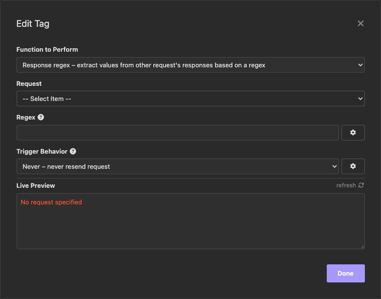

# Response Body Regex

This Insomnia plugin provides a way to call a different request from 
your collection and extract a specific value based on a regex.

----

## Installation

### From Insomnia Plugin Hub

1. Navigate to [https://insomnia.rest/plugins/insomnia-plugin-response-body-regex](https://insomnia.rest/plugins/insomnia-plugin-response-body-regex)
2. Click on _Install Plugin_
3. Click _Open_
4. Once opened, click on _Install_

### From the Insomnia App

1. Go to _Application_ > _Preferences_ **or** click the cog icon (⚙️)
2. Navigate to the _Plugins_ tab
3. Enter `insomnia-plugin-response-body-regex`
4. Click on _Install_

## Usage

- Press Ctrl + Space where you want to add a request call with regex extraction
- Type `response`
- Select `Response regex` to display this window:

- Select the request you want to call from the dropdown list
- Type the regex you want to use with the result of the request, make 
sure to surround the expected value with a capture group (using parenthesis)
- You can choose when to perform a new call to the request
- Visualize a preview of the result in the `Live Preview` area and adjust 
the regex accordingly